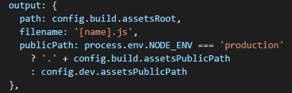

# Vue2.0/bilibili-webapp

## 前言

>之前看到很多人写过ele的vue项目，我也跟着写了一下，但是当时用的是vue1.0写的，考虑到vue2.0出来都很长时间了，现在大家应该都转向了2.0了，开始也想直接将那么1.0的项目给升级成2.0，但是后来想干脆就直接在写一个项目就好了，于是就想要写一个vue2.0的webapp项目，至于为何将目光放到了bilibili，一部分因为我在github上看到了一个bilibili的首页项目<br>
>作者：[lybenson](https://github.com/lybenson)<br>
>项目地址：[前端vue+后端koa，全栈式开发bilibili首页](https://github.com/lybenson/bilibili-vue)<br>
>预览地址：[http://www.lybenson.com/bilibili/](http://www.lybenson.com/bilibili/)<br>
>然后就想我干脆写一个移动端的项目好了，而bilibili本身有自己的移动端网站，我总不能讲人家的移动端网站直接抄过来吧，所以我将目光转移到了自己手机用得最多的app之一（哔哩哔哩客户端），B站的设计美观大方，并且细节满满，相信用过的都懂。
>目前技术栈准备使用：前端vue2.0，后端koa2.0的方式，语法使用ES6为主，数据来自B站真实的数据接口。<br>
>看了B站主页项目的人肯定会发现，这技术使用不是和人家差不多吗？其实不一样啦，人家做的是PC端网站，我做的是移动端app啦!<br>
<br>
虽然没有PC端厉害，但我好歹不止实现了一个主页吧！

## 技术栈

前端：vue2.0 + vuex + vue-cli + ES6/7 + stylus
后端：koa2.0

## 项目运行

```shell
  git init
  git clone https://github.com/YMaster/bilibili-vue2.git
```
>后端运行
```shell
  cd bilibili-api
  npm install
  npm start
```
前端运行
```shell
  cd bilibili-vue2.0
  npm install
  npm run dev
```
如果网速状态良好，建议使用`npm`原址进行`npm install`。

## build
执行：
```shell
  npm run build
```
运行后无论是将文件放置到服务器还是在本地打开都会发现静态资源无法加载出来，原因在于打包后的路径是 `/` ，需要将其改成 `./` 即可。
`lybenson` 采用的方式是 在`webpack.base.conf.js`中修改js文件的输出路径中的`publicPath`，而我选择在不改变`vue-cli`的文件内容结构的情况下给原本的`webpack.base.conf.js`文件中的`publicPath`后面的`config.build.assetsPublicPath`前添加 `.` 即可。<br><br>
<br><br>
不知道`lybenson`使用`vue-cli`时是不是`css`文件真页找不着，但是我在搭建项目结构的时候并没有遇到这个问题，仅仅是js文件的路径需要修改而已，因此我的`css`文件路径并不需要调整。

## 项目功能

```shell
├── 综合推荐
│
├── 直播
│     ├── 分类全部分类
│     ├── 关注
│     ├── 中心
│     ├── 小视频
│     ├── 搜索
│     ├── 各大直播版块的详情页
│     └── 直播房间(这个由于原生app中直播与网页直播的事项方式不同，本人现在无法实现，后面看能不能找到网页直播的接口再尝试实现)
│
├── 追番
│     ├── 番剧
│     ├── 国创
│     ├── 我的追番
│     ├── 饭局推荐
│     ├── 国产动画推荐
│     └── 各追番板块详情页
│
├── 分区
│     ├── 分区导航
│     ├── 番剧区
│     ├── 动画区
│     ├── 国创区
│     ├── 音乐区
│     ├── 舞蹈区
│     ├── 游戏区
│     ├── 科技区
│     ├── 生活区
│     ├── 鬼畜区
│     ├── 时尚区
│     ├── 广告区
│     ├── 娱乐区
│     ├── 电影区
│     └── 电视剧
│
├── 游戏中心(并不能下载和预约哦)
│
├── 动态(需要登录才可以看，这里就不加了,先把前面功能实现,后续有时间会考录做进去的)
│
└── 发现(通动态一样)
```
## 总结

已经搭建基本结构，vue-cli采用webpack<br>
后台：koa已经实现首页数据和直播页面以及直播各大板块数据的获取<br>
前端：路由切换、轮播图组件实现<br>
其他功能...<br>
正在努力实现中...<br>
持续更新中...